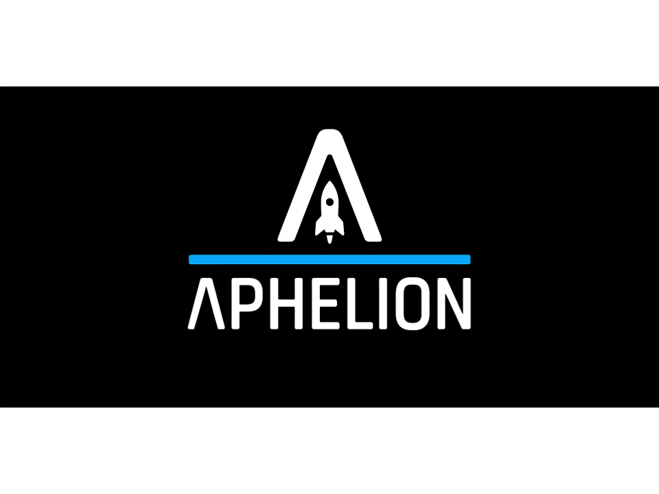

# Project Aphelion 🚀

Welcome to **Project Aphelion**, where we explore the edge of innovation and open-source space tech!

## 🌌 Our Mission
Build a self-landing rocket. From scratch.

## 📂 Projects

### 🔧 [Odysseus](https://github.com/Project-Aphelion/Odysseus) – *Laying the Groundwork*  
**Odysseus** is our foundational proof-of-concept platform, designed to get hands-on with rocket construction and toolchains. It features a basic **sugar-based rocket motor** and an integrated **parachute recovery system**. The primary goal is to develop and test our **in-house airframe design**, validate manufacturing techniques, and establish a reliable workflow for rapid prototyping.

### 🛰️ [Kratos](https://github.com/Project-Aphelion/Kratos) – *Precision in Motion*  
**Kratos** builds upon the lessons from Odysseus, transitioning from exploration to **optimization**. This platform focuses on refining rocket dynamics and integrating our **custom-built Thrust Vector Control (TVC) system** for enhanced maneuverability. The goal: achieve **stable and controlled flight** through precise tuning of aerodynamics, propulsion, and guidance.

### 🚀 [Ares](https://github.com/Project-AphelionLabs/Ares) – *Autonomy and Recovery*  
**Ares** is the culmination of the Aphelion project arc, combining all prior innovations into a bold leap forward. With a **dual-motor configuration** and integrated **landing gear**, Ares is engineered for **powered descent and recovery** — achieving a self-propelled, soft landing. It unites structural, control, and propulsion systems into a reusable launch vehicle concept.

## Support us!
We are funded entirely out of pocket so any support means the world to us! Go check out our patreon for exclusive designs, tests, source-code and other exciting content!

---

🛠️ Powered by [Project-Aphelion](https://github.com/Project-Aphelion)
